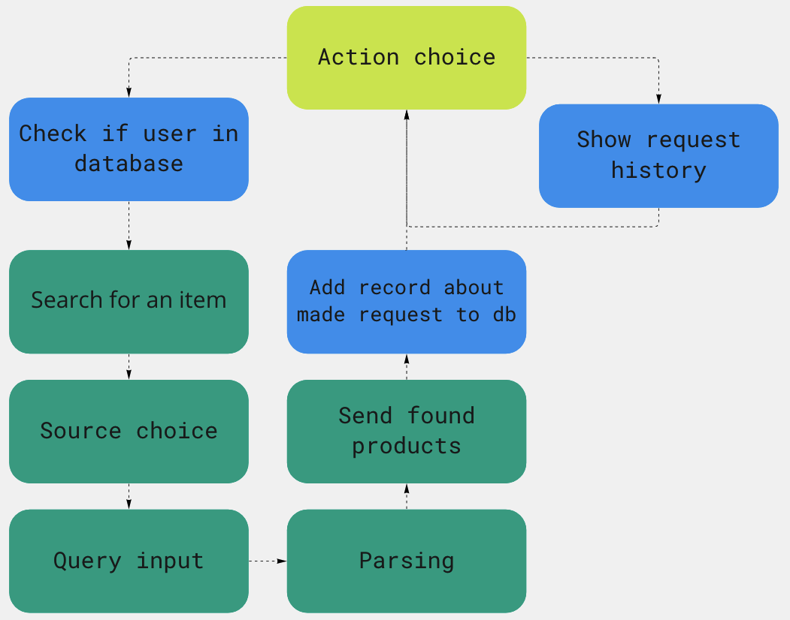

# Config
*This block refers to `mts_hw_module/setup/config.py`*

It's good to start with the config file, so let's waste no time and see the code:
```Python
import os
from dotenv import load_dotenv
from pydantic import BaseModel

load_dotenv()

TOKEN = os.environ.get("TOKEN")

#Buttons for bot
HISTORY = 'History of searches'
SEARCH = 'Search for an item'
MVIDEO = 'МВидео'
TEKNOPARK = 'Технопарк'
ALL = 'Search in all'
MAX_REQUESTS_TO_SHOW = 10

#Database settings
class Settings(BaseModel):
    database_source: str = 'sqlite:///./sql_app.db'

settings = Settings()
```

Firstly, we see the imports:
- os module is needed for getting the environmental variables
- `load_dotenv` is required for loading `.env` file, where environmental variables are stored (e.g bot token)
- `BaseModel` object will be used for implementing `Settings` object

Then, we watch the bot's buttons appear, no need to focus on them

Now on to the `Settings` model:
- the class is herited from `BaseModel` object
- the class is used to store some database information (e.g source)

Then, the `settings` instance is created, we can do that here, since we only going to need one.

# Database
## Modelling 
*This block refers to `mts_hw_module/database/database_models.py`*

In this project i decided to create only a database.

Table consists of the following columns:

| Column | Type | Description|
|--------|------|------------|
|id|`int`|Request id
|user_id|`int`| The id of user making request|
|search_query|`str`|Query user sent
|shop|`str`|Parsing uery sources|

Database is implemented in `ORM` format.

*Now on to the code*:
```Python
from sqlalchemy.ext.declarative import declarative_base
import sqlalchemy as sa

Base = declarative_base()
```
In this part the required libraries and modules are being imported, then we declare the `Base`(the basic class of the database) by calling `declarative_base()`.

Further i created a `Request` class which will be used in database, added table name and implemented the above columns:
```Python
class Request(Base):
    __tablename__ = 'requests'

    id = sa.Column(sa.Integer, primary_key=True)
    user_id = sa.Column(sa.Integer)
    search_query = sa.Column(sa.String)
    shop = sa.Column(sa.String)
```

That's it for the database modelling, now on to the functions itself.

## Functions
*This block refers to `mts_hw_module/database/database.py`*

Again imports:
```Python
from typing import List
from sqlalchemy import create_engine
from sqlalchemy.orm import sessionmaker
from mts_hw_module.setup.config import settings
from .database_models import Request, Base
```

Creating one of the `ORM`'s most important objects - engine. That is the thing, that is going to connect us to database.

```Python
engine = create_engine(
    settings.database_source,
    connect_args={"check_same_thread": False},
)
```
The following code is needed to create all tables we specified in `database_models.py`:
```Python
Base.metadata.create_all(engine)
```

Then we create the `Session` object (the second important `ORM` object) by calling the `sessionmaker` function(it's uppercase be the `sessionmaker` returns a class)

```Python
Session = sessionmaker(
    autocommit=False,
    autoflush=False,
    bind=engine,
)
```
- false autocommit ensures the commit to database is being made only we want it
- false autoflush ensures we dont send request to database automatically
- bind is used for linking engine object to our session

With all that base we created, we are ready to move to the functions:
```Python
def add_request_record(user_id:int, search_query:str, shop:str) -> None:
    with Session() as session:
        new_request = Request(user_id=user_id, search_query=search_query, shop=shop)
        session.add(new_request)
        session.commit()

def check_if_user_in_base(user_id:int) -> bool:
    with Session() as session:
        user = session.query(Request).filter_by(user_id=user_id).first()
        
    if user is not None:
        return True
    return False

def retrieve_user_requests(user_id:int) -> List[Request]:
    with Session() as session:
        requests = session.query(Request).filter_by(user_id=user_id).all()
    return requests
```
It is easy to understand what each of them does, not thinking it is necessary to stop on them.

That wraps it up for database module, let's talk about *'global'* models required for this project.

# 'Global' models

*This block refers to `mts_hw_module/models.py`*

Imports:
```Python
from time import sleep
from typing import List, Union
from selenium import webdriver
from webdriver_manager.chrome import ChromeDriverManager
from selenium.webdriver.common.by import By
from selenium.webdriver.common.keys import Keys
```

It's actually quite clear why each of them is here, except maybe the `selenium` module. `selenium` module lets us simulate the work of the Chrome window to load web pages.

So I implemented two global models for further code scalability: `Item` and `Shop`.

## Item model

Let's see the code:
```Python
class Item:
    def __init__(self, name:str, price:str, link_to_image:str, link:str, shop:str) -> None:
        self.name = name.replace('\n', '').strip()
        self.price = price
        self.link_to_image = link_to_image
        self.link = link
        self.shop = shop

    def __str__(self) -> str:
        return f'Item Name: {self.name} Price: {self.price} Shop:{self.shop}'

    def __repr__(self) -> str:
        return f'Item Name: {self.name} Price: {self.price} Shop:{self.shop}'
```

`Item` object is the wrapper for the product we found online, which contains its name, price, link to its image, link to itself and source shop.

## Shop model

This model is a little bigger:
```Python
class Shop:
    def __init__(self, name:str, link:str) -> None:
        self.name = name
        self.link = link

    def __str__(self) -> str:
        return f'Shop Name: {self.name}'

    def __repr__(self) -> str:
        return f'Shop Name: {self.name}'

    def get_html(
        self,
        query:str, 
        input_xpath:str,
        scroll:bool=False,
        scroll_timeout:Union[float, int]=0.3,
        time_to_load_main_page:int=2,
        time_to_load_query_request:int=3,):

        driver = webdriver.Chrome(ChromeDriverManager().install())
        driver.get(self.link)

        sleep(time_to_load_main_page)

        search_input = driver.find_element(By.XPATH,input_xpath)
        search_input.send_keys(str(query))
        search_input.send_keys(Keys.ENTER)

        sleep(time_to_load_query_request)
        
        if scroll:
            for i in range(5):
                sleep(scroll_timeout)
                driver.execute_script(f"window.scrollTo({i * 300}, {(i+1)*300})") 

        html = driver.page_source
        driver.close()

        return html

    @staticmethod
    def pack_items(
        names:List[str], 
        prices:List[str],
        image_sources:List[str], 
        links:List[str],
        max_items:int,
        source:str) -> List[Item]:
        items = []
        n_items = min(len(names), max_items)

        for i in range(n_items):
            items.append(Item(names[i], prices[i], image_sources[i], links[i], source))
            
        return items   
```

Wow, looks pretty big and unclear.

So, the `Shop` object has 2 main attributes: link and name. Pretty obvious what both of them are, not stopping here.

Then two dunder methods appear: `__repr__` and `__str__`. Again, I see no reasons to stop on them, pretty clear what happens here.

Now the fun part: `get_html` method. 

### get_html method

For your convenience attributes description is presented in the following table:

|Attribute| Type | Description|
|---------|------|------------|
|query|`str`|The name of the product we want to find information about|
|input_xpath|`str`|[XPath](https://en.wikipedia.org/wiki/XPath) of the `input` on the main page of shop|
|scroll|`bool`|Set it to `True` if you want `selenium` to execute scrolling script on the page of the search results|
|scroll_timeout|`int` or `float`| Timeout between each scroll execution|
|time_to_load_main_page|`int`|The number of seconds required for loading main shop page|
|time_to_load_query_request|`int`|The number of seconds required to load the page of search results of query|

So, let's understand the algorithm of getting html:

1. Firstly, we load shop's main page using `selenium`'s driver:
    ```Python
    driver = webdriver.Chrome(ChromeDriverManager().install())
    driver.get(self.link)
    ```
2. Wait for it to fully load by waiting a few seconds:
    ```Python
    sleep(time_to_load_main_page)
    ```
3. Then we seek for the `input` element on our page by the XPath we've given, insert our search query into it and simulate clicking Enter key: web page starts to load.
    ```Python
    search_input = driver.find_element(By.XPATH,input_xpath)
    search_input.send_keys(str(query))
    search_input.send_keys(Keys.ENTER)
    ```
4. Again, wait a few seconds for it to fully load:
    ```Python
    sleep(time_to_load_query_request)
    ```
5. (Optional) If you set the `scroll` attribute to `True`, scrolling script will be executed 5 times:
    ```Python
    if scroll:
        for i in range(5):
            sleep(scroll_timeout)
            driver.execute_script(f"window.scrollTo({i * 300}, {(i+1)*300})") 
    ```

6. The final steps: get html page source and close the driver:
    ```Python
    html = driver.page_source
    driver.close()
    ```
7. Finally, return the html itself:
    ```Python
    return html
    ```

### pack_items method

So, this method packs all parsed products into one list of `Items` for our convenience.

Again, attributes table:

|Attribute| Type| Description|
|---------|-----|------------|
|names|`list` of `str`|The list of products names|
|prices|`list` of `str`|The list of products prices|
|image_sources|`list` of `str`|The list of links to product's images|
|links|`list` of `str`|The list of links to parsed products|
|max_items| `int` | Maximum number of products to pack|
|source| `string` | Shop or source from which we parsed information|

Algorithm here is extremely simple(not even providing code):

1. Create empty `items` list to which all products will be packed.
2. Then choose adjust the number of products we want to pack(what if we found less than we wanted)
3. Create `Item` object out of each name, price, image_source, link and source shop.
4. Append it to `items`
5. Return the `items`

# Parsing
*This block refers to `mts_hw_module/parsing/parsers.py`*

Imports:
```Python
from typing import List, Union
from bs4 import BeautifulSoup
from mts_hw_module.models import Item, Shop
import mts_hw_module.setup.config as cfg
```
What we see:
- type-hinting objects
- BeautifulSoup object for parsing htmls
- models we spoke about above
- config import

I implemented two parsers(both iherited from `Shop` object): for mvideo and teknopark shops.

## MvideoParser

Code:
```Python
class MvideoParser(Shop):
    def __init__(self):
        Shop.__init__(self, 'Mvideo', 'https://www.mvideo.ru')

    def parse(self, query:str, max_items:int=5, results:list=[], return_items:bool=True) -> Union[None, List[Item]]:
        if not query:
            raise ValueError("query cannot be empty")

        html = self.get_html(input_xpath='//*[@id="1"]', query=query)
        soup = BeautifulSoup(html, 'html.parser')

        a_elements = soup.find_all('a', {'class':'product-title__text'})
        links = [self.link + element['href'] for element in a_elements]
        names = [element.text.replace('\xa0', '') for element in a_elements]

        spans = soup.find_all('span', {'class':'price__main-value'})
        prices = [span.text.replace('\xa0', '') for span in spans]

        a_image_elements = soup.find_all('a', {'class':'product-picture-link'})
        images = []

        for a_el in a_image_elements:
            image_soup = BeautifulSoup(str(a_el), 'html.parser')
            images.append(image_soup.find('img', {'class':'product-picture__img'}))

        image_sources = ['https:' + image['src'] for image in images]

        items = self.pack_items(names, prices, image_sources, links, max_items, cfg.MVIDEO)

        if return_items:
            return items
        else:
            results += items
```

Let's immediately jump to `parse` method, `__init__` has no shocking or unclear code here.

### parse method of `MvideoParser`

Attributes table:
|Attribute| Type| Description|
|---------|-----|------------|
|query|`str`|The name of the product we want to find information about|
|max_items|`int`| Maximum number of products to pack|
|results|`list`|List of results to extend(pass only when parsing in parallel)
|return_items|`bool`|Pass `True` if you want the method to return the list of `Items` or not(also provided for parsing in parallel)|

Let's again understand the algorithm step by step:
1. Ensuring query is actually `str`(if not raising `ValueError`)
    ```Python
    if not query:
            raise ValueError("query cannot be empty")
    ```
2. Getting source html of page by calling `get_html` method and passing XPath and query itself and then creating `BeautifulSoup` object from it.
    ```Python
    html = self.get_html(input_xpath='//*[@id="1"]', query=query)
    soup = BeautifulSoup(html, 'html.parser')
    ```
3. Searching and retrieving names from a single html elements:
    ```Python
    a_elements = soup.find_all('a', {'class':'product-title__text'})
    links = [self.link + element['href'] for element in a_elements]
    names = [element.text.replace('\xa0', '') for element in a_elements]
    ```
4. Retrieving prices from page source code:
    ```Python
    spans = soup.find_all('span', {'class':'price__main-value'})
    prices = [span.text.replace('\xa0', '') for span in spans]
    ```
5. Getting image's sources (first find the `a` elements in which images are stored, then take only the first one from each):
    ```Python
    a_image_elements = soup.find_all('a', {'class':'product-picture-link'})
    images = []

    for a_el in a_image_elements:
        image_soup = BeautifulSoup(str(a_el), 'html.parser')
        images.append(image_soup.find('img', {'class':'product-picture__img'}))

    image_sources = ['https:' + image['src'] for image in images]
    ```
6. Packing information:
    ```Python
    items = self.pack_items(names, prices, image_sources, links, max_items, cfg.MVIDEO)
    ```
7. Either extending `results` or returning `items`.
    ```Python
    if return_items:
        return items
    else:
        results += items
    ```

## TeknoparkParser

Code:
```Python
class TeknoparkParser(Shop):
    def __init__(self):
        Shop.__init__(self, 'Teknopark', 'https://www.technopark.ru')

    def parse(self, query:str, max_items:int=5, results:list=[], return_items:bool=True) -> Union[None, List[Item]]:
        if not query:
            raise ValueError("query cannot be empty")

        html = self.get_html(input_xpath='//*[@id="header-search-input-main"]', query=query, scroll=True)
        soup = BeautifulSoup(html, 'html.parser')

        image_divs = soup.find_all('div', {'class':'card-listing__image'})
        div_soup = BeautifulSoup(str(image_divs), 'html.parser')
        image_elements = div_soup.find_all('img')
        image_sources = [image_element['data-src'] for image_element in image_elements]

        names_elements = soup.find_all('div', {'class':'card-listing__name'})
        names = [name_element.text for name_element in names_elements]

        a_elements = soup.find_all('a', {'class' : 'card-listing__title'})
        links = [self.link + a_element['href'] for a_element in a_elements]

        price_elements = soup.find_all('span', {'class':'price'})
        prices = [price_element.text for price_element in price_elements]

        items = self.pack_items(names, prices, image_sources, links, max_items, cfg.TEKNOPARK)

        if return_items:
            return items
        else:
           results += items
```
Again, I see no reason to focus on `__init__`, let's talk about `parse` method.

## parse method of `TeknoparkParser`
Attributes are absolutely the same as in the `MvideoParser`'s `parse`:
|Attribute| Type| Description|
|---------|-----|------------|
|query|`str`|The name of the product we want to find information about|
|max_items|`int`| Maximum number of products to pack|
|results|`list`|List of results to extend(pass only when parsing in parallel)
|return_items|`bool`|Pass `True` if you want the method to return the list of `Items` or not(also provided for parsing in parallel)|

Parser algorithm:
1. Ensuring query is actually `str`(if not raising `ValueError`)
    ```Python
    if not query:
            raise ValueError("query cannot be empty")
    ```
2. Getting source html of page by calling `get_html` method and passing XPath, query, setting `scroll` attribute to `True` and then creating `BeautifulSoup` object from it.
    ```Python
    html = self.get_html(input_xpath='//*[@id="header-search-input-main"]', query=query, scroll=True)
    soup = BeautifulSoup(html, 'html.parser')
    ```
3. Searching for `div` elements in which images are stored, retrieving `img` elements and then finding image sources:
    ```Python
    image_divs = soup.find_all('div', {'class':'card-listing__image'})
    div_soup = BeautifulSoup(str(image_divs), 'html.parser')
    image_elements = div_soup.find_all('img')
    image_sources = [image_element['data-src'] for image_element in image_elements]
    ```
4. Retrieving names:
    ```Python
    names_elements = soup.find_all('div', {'class':'card-listing__name'})
    names = [name_element.text for name_element in names_elements]
    ```
5. Not forgeting about links:
    ```Python
    a_elements = soup.find_all('a', {'class' : 'card-listing__title'})
    links = [self.link + a_element['href'] for a_element in a_elements]
    ```
6. And, of course, prices:
    ```Python
    price_elements = soup.find_all('span', {'class':'price'})
    prices = [price_element.text for price_element in price_elements]
    ```
7. Packing information:
    ```Python
    items = self.pack_items(names, prices, image_sources, links, max_items, cfg.TEKNOPARK)
    ```
8. Either extending `results` or returning `items`.
    ```Python
    if return_items:
        return items
    else:
        results += items
    ```

# Wrapping everything in Telegram bot
*This block refers to `main.py`*

Since we've discussed every module, it's time to wrap everything into telegram bot.

Let's understand every part of `main.py`.

Here is the flowchart explaining file logic:


Firstly and now traditionally, of course, imports:
```Python
import requests
import threading
import telebot
from telebot import types
import mts_hw_module.setup.config as cfg
from mts_hw_module.parsing.parsers import TekhnoparkParser, MvideoParser
import mts_hw_module.database.database as db
```

- `requests` will be used for getting images from web
- `threading` will help us parallelize parsing
- We will write bot's logic using `telebot` 
- `types` object will help us create keyboard in Telegram
- `cfg`, `TeknoparkParser`, `MvideoParser` and `db` objects will help us handle reuests to our bot

Creating bot:
```Python
bot = telebot.TeleBot(cfg.TOKEN)
```

So, it begins...

```Python
@bot.message_handler(commands=['start'])
def send_keyboard(message, text:str='Hello, how can I help you?'):
    keyboard = types.ReplyKeyboardMarkup(row_width=2)
    search_button = types.KeyboardButton(cfg.SEARCH)
    history_button = types.KeyboardButton(cfg.HISTORY)

    keyboard.add(search_button, history_button)

    if not db.check_if_user_in_base(message.from_user.id):
        bot.send_message(message.chat.id, 'Looks like you have never been here before!')

    message = bot.send_message(
        message.from_user.id,
        text=text,
        reply_markup=keyboard,
    )

    bot.register_next_step_handler(message, callback_worker)
```

This function will be executed once user sends `/start`.

Pipeline logic:

1. Create a keyboard to choose action: search for an item or show history of requests.

    ```Python
    keyboard = types.ReplyKeyboardMarkup(row_width=2)
    search_button = types.KeyboardButton(cfg.SEARCH)
    history_button = types.KeyboardButton(cfg.HISTORY)

    keyboard.add(search_button, history_button)
    ```

2. Check if user talking to us is already in our database(if not send him the 'first time' message):
    ```Python
    if not db.check_if_user_in_base(message.from_user.id):
        bot.send_message(message.chat.id, 'Looks like you have never been here before!')
    ```
3. Let user choose action to execute: search for some item or just show history of his requests:
    ```Python
    message = bot.send_message(
        message.from_user.id,
        text=text,
        reply_markup=keyboard,
    )

    bot.register_next_step_handler(message, callback_worker)
    ```
4. Last line sends us directly to `callback_worker` function:
    1. If user chooses to search some product:
        ```Python
        if message.text == cfg.SEARCH:
        ```
        1. First, some send him message:
            ```Python
            message = bot.send_message(message.chat.id, 'Okay, let\'s search for an item')
            ```
        2. Prepare 'source' keyboard:
            ```Python
            keyboard = types.ReplyKeyboardMarkup(row_width=2)
            ozon_button = types.KeyboardButton(cfg.TEKNOPARK)
            mvideo_button = types.KeyboardButton(cfg.MVIDEO)
            all_button = types.KeyboardButton(cfg.ALL)

            keyboard.add(ozon_button, mvideo_button)
            keyboard.add(all_button)
            ```
        3. Then user should input query he wants and go to the next block:
            ```Python
            message = bot.send_message(
                message.chat.id, 
                text='Where shall I seek?',
                reply_markup=keyboard,
            )

            bot.register_next_step_handler(message, shop_choice)
            ```
    2. If user chooses to see history of requests:
        ```Python
        elif message.text == cfg.HISTORY:
        ```
        1. Retrieve all user's requests from database:
        ```Python
        user_requests = db.retrieve_user_requests(message.from_user.id)
        ```
        2. Check if number of all user requests is greater than we want to show
        ```Python
        num_requests = min(len(user_requests), cfg.MAX_REQUESTS_TO_SHOW)
        ```
        3. Send data:
            1. If number of requests is 0, just send the message:
            ```Python
            if num_requests == 0:
                bot.send_message(message.chat.id, 'You haven\'t done any requests yet!')
            ```
            2. If not, prepare `response` string and extend it with user's requests information:
            ```Python
            else:
                response = f'Here is your {num_requests} last requests: \n'

                for i, request in enumerate(user_requests[:num_requests]):
                    response += f'{i+1}. Query: {request.search_query} Shop: {request.shop}\n'

                bot.send_message(message.chat.id, response)
            ```
        4. Go back to original keyboard:
        ```Python
        send_keyboard(message, 'Anything else I can do for you?')
        ```
    3. If user send some kind of crap:
        ```Python
        else:
            bot.send_message(message.chat.id, 'Did not understand you!')
        ```
5. `shop_choice` function:
    1. If user chose 'Mvideo', ask him about what he would like search for and then send his request to `mvideo_handler`:
        ```Python
        if message.text == cfg.MVIDEO:
            message = bot.send_message(
                message.chat.id, 
                text='What shall I seek?',
                reply_markup=types.ReplyKeyboardRemove())

            bot.register_next_step_handler(message, mvideo_handler)
        ```
    2. Same thing with the 'Teknopark':
        ```Python
        elif message.text == cfg.TEKNOPARK:
            message = bot.send_message(
                message.chat.id, 
                text='What shall I seek?',
                reply_markup=types.ReplyKeyboardRemove())

            bot.register_next_step_handler(message, teknopark_handler)
        ```
    3. And with 'all sources' button too:
        ```Python
        elif message.text == cfg.ALL:
            message = bot.send_message(
                message.chat.id,
                text = 'What shall I seek?',
                reply_markup=types.ReplyKeyboardRemove())

            bot.register_next_step_handler(message, parse_all_sources)
        ```
    4. We also have to handle cases when user send us some crap and call the original keyboard:
        ```Python
        else:
            send_keyboard(message, 'Did not understand you!!')
        ```
6. Parsing:
    1. Mvideo case(calling `mvideo_handler`):
        1. Send user a message, so he wouldn't worry:
            ```Python
            bot.send_message(message.chat.id, 'Please wait...')
            ```
        2. Create parser instance and parse the specific query:
            ```Python
            parser = MvideoParser()
            items = parser.parse(message.text)
            ```
        3. Call `send_content` function, so bot could wrap everything nicely and tradionally call original keyboard:
            ```Python
            send_content(items, message.chat.id)
            send_keyboard(message, 'Anything else I can do for you?')
            ```
        4. Add a record to database:
            ```Python
            db.add_request_record(message.from_user.id, message.text, cfg.MVIDEO)
            ```
    2. Teknopark case(calling `teknopark_handler`):
        1. Send user a message, so he wouldn't worry:
            ```Python
            bot.send_message(message.chat.id, 'Please wait...')
            ```
        2. Create parser instance and parse the specific query:
            ```Python
            parser = TeknoparkParser()
            items = parser.parse(message.text)
            ```
        3. Call `send_content` function, so bot could wrap everything nicely and tradionally call original keyboard:
            ```Python
            send_content(items, message.chat.id)
            send_keyboard(message, 'Anything else I can do for you?')
            ```
        4. Add a record to database:
            ```Python
            db.add_request_record(message.from_user.id, message.text, cfg.TEKNOPARK)
            ```
    3. 'All sources' case(calling `parse_all_sources`):
        1. Define all parsers:
            ```Python
                parsers = (MvideoParser, TeknoparkParser)
            ```
        2. Create lists for threads and parsed items:
            ```Python
            thread_list, items = [], []
            ```
        3. Create parser instance, `Thread` out of each parser, add it to `thread_list` and start thread:
            ```Python
            for Parser in parsers:
                parser = Parser()
                thread = threading.Thread(target=parser.parse, args=(message.text, 2, items, False))
                thread_list.append(thread,)
                thread.start()
            ```        
        4. Wait until all of threads are done:
            ```Python
            for i in range(len(thread_list)):
                thread_list[i].join()
            ```
        5. `send_content`, call original keyboard, add record to database:
            ```Python
            send_content(items, message.chat.id)
            send_keyboard(message, 'Anything else I can do for you?')
            db.add_request_record(message.from_user.id, message.text, cfg.ALL)
            ```
7. `send_content` function:

    Attributes:
    |Attribute| Type | Description|
    |---------|------|------------|
    |items| `list` of `Item`| all parsed products|
    |chat_id|`int`|the id of chat to which send data|

    And code:
    ```Python
    def send_content(items, chat_id):
        if len(items) == 0:
            bot.send_message(chat_id, 'Sorry, nothing was found!')
        else:
            for item in items:
                response = requests.get(item.link_to_image)
                bot.send_photo(chat_id, response.content)

                text = f'Name: {item.name} \n Price: {item.price} \n Link: {item.link} \n Source: {item.shop}'
                bot.send_message(chat_id, text)
    ```

    Algorithm:
    1. First check if `items` list is empty, if so, send the message, if not, move to the next step:
        ```Python
        if len(items) == 0:
            bot.send_message(chat_id, 'Sorry, nothing was found!')
        ```
    2. If `items` is not empty - go through each item and send information to the chat:
        ```Python
        else:
            for item in items:
                response = requests.get(item.link_to_image) #get image in bytes-like format
                bot.send_photo(chat_id, response.content) #send image

                text = f'Name: {item.name} \n Price: {item.price} \n Link: {item.link} \n Source: {item.shop}'
                bot.send_message(chat_id, text) #send information about product
        ```
8. Finally, to start bot, we only need 3 more lines of code:
    ```Python
    if __name__ == '__main__':
        print("Bot started!!")
        bot.infinity_polling()
    ```